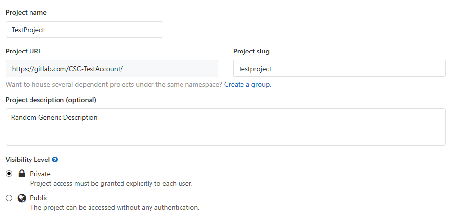
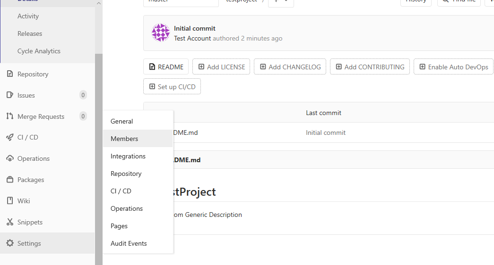
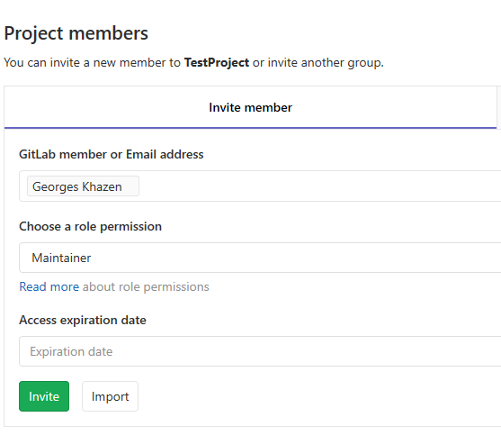
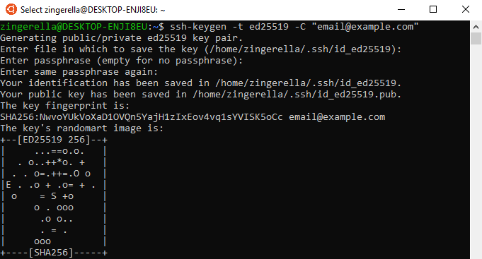
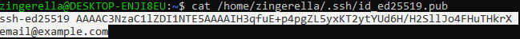
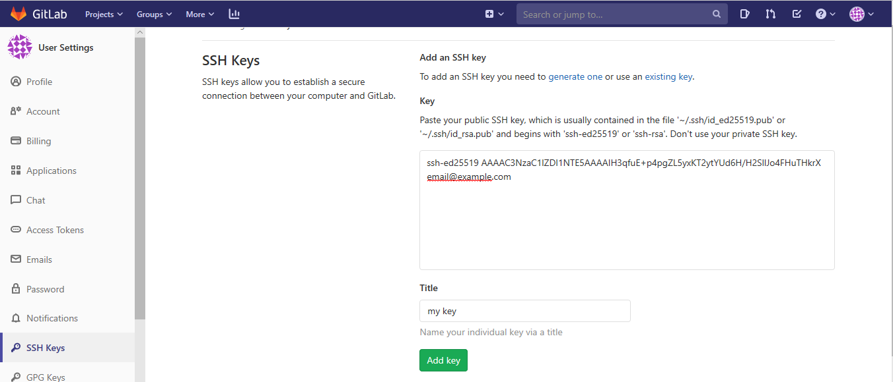
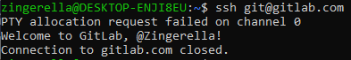

# gitlab-and-ssh
Learn how to setup a connection with your gitlab account using ssh.

## Create a Gitlab account
First, you'll have to create a gitlab account. Go to [**gitlab**](https://gitlab.com/users/sign_up) and start with the account creation process.
----
## Setup your repository

### Create your first repository
* **Create a project**

* **Fill in needed details**

* **Add your professor as a maintainer**

---- 
### Setup SSH from the terminal

* **Open the terminal**: Either use CTRL+ALT+T or open the terminal icon
* **Create your public SSH Key**:
  * Execute command: ssh-keygen -t ed25519 -C "youremail@example.com"
  * Press Enter to skip changing permissions/changing the key's directory
  
  * Copy the ssh key using "xclip path/to/key" or cat the content of they key and copy it using CTRL+SHIFT+C or rightclick+copy:
  
  
* **Locate the SSH Keys page from your profile settings**
 or use the url to get there
  * Paste the key into the box and add it
* **Check if everything's working**
  Run "ssh git@gitlab.com". If you get a welcome message, you're good to go!
  
